# Автоматизация продаж и исполнения заказов: n8n + amoCRM + AI

Сквозная автоматизация для компании, которая изготавливает детали из стали и полимеров по чертежам и 3D-моделям клиентов силами подрядчиков из Китая. Сделка проходит 15 этапов в amoCRM: от входящего письма с чертежами до закрывающих документов и проверки качества у клиента. На каждом этапе автоматика берёт на себя рутину, ставит задачи сотрудникам, следит за сроками и переводит сделку дальше.

**31 воркфлоу n8n · 2 Telegram-бота · 2 сервиса на Python · Google Gemini для чертежей, писем и голоса**

Единственный разработчик · с июня 2026 года · в эксплуатации

> Воркфлоу n8n в репозитории не публикуются: здесь описание архитектуры, логики и скриншоты. Два сервиса проекта открыты отдельно: [kp-bot](https://github.com/MaxBakshaev/kp-bot) и [parts-table-builder](https://github.com/MaxBakshaev/parts-table-builder).

| Документ | Что внутри |
|---|---|
| [Каталог воркфлоу](docs/workflows.md) | назначение каждого из 31 воркфлоу, триггеры и хранилища |
| [Истории из разработки](docs/stories.md) | 49 разборов «проблема → решение → результат» |
| [ИИ-агент: дорожная карта](docs/ai-agent-roadmap.md) | агент на Claude для этапов 7–9 и реактивации клиентов |

## Содержание

- [Задача и результат](#задача-и-результат)
- [Как это работает](#как-это-работает)
- [Архитектура и стек](#архитектура-и-стек)
- [Этапы воронки](#этапы-воронки)
- [Сквозные подсистемы](#сквозные-подсистемы): [TG-Бот Контроль задач](#tg-бот-контроль-задач), [TG-Бот Бухгалтерия](#tg-бот-бухгалтерия), [форма заявок](#заявки-через-форму-n8n)
- [Надёжность, безопасность и бэкап](#надёжность-безопасность-и-бэкап)
- [Статус и планы](#статус-и-планы)

## Задача и результат

**Контекст.** Каждая сделка — это десятки файлов (чертежи, 3D-модели, DWG, расчёты, КП, счета, УПД, фото), переписка с клиентом и с производством в Китае, задачи для нескольких сотрудников и своя история. При 10–20 сделках в месяц и растущем потоке удерживать всё это в голове и в таблицах уже не получалось.

**Что делалось вручную:** разобрать письмо и завести сделку; найти или создать клиента, не наплодив дублей; разложить и переименовать файлы; собрать ТЗ; отправить запрос на производство и разобрать ответ; посчитать цену; оформить КП, счёт, спецификацию и УПД; проследить за упаковкой, фото, отгрузкой и документами.

**Главный эффект — структура.** У каждой сделки единый маршрут, типовая папка и полная история в карточке, у каждой задачи есть исполнитель, срок и контроль.

| Показатель | Результат |
|---|---|
| ⏱️ Время на рутинные операции | сократилось примерно на 80 % |
| 🎯 Потерянные задачи | практически 0 |
| ✅ Задачи, закрытые в срок | заметно выросли, до 60–70 % |
| 📈 Сделки | 10–20 в месяц, поток растёт |
| 👥 Пользователи | 4 сотрудника в ролях менеджера, инженера, ассистента и руководителя; штат расширяется |

## Как это работает

Воронка в amoCRM — 15 рабочих этапов в трёх фазах. Цвет показывает фазу, пунктир — этапы в разработке и в планах.

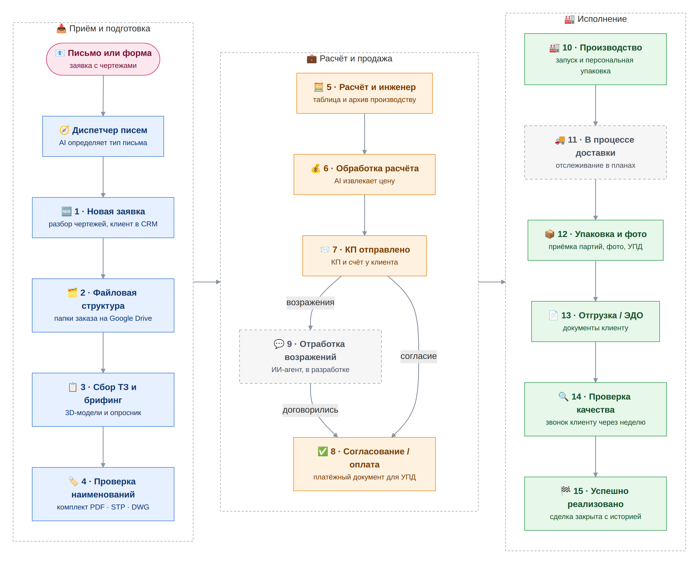

### Кто запускает каждый шаг

Работу двигают четыре участника. Заказчик присылает письмо, автоматика разбирает его и ставит задачи, команда отвечает в Telegram-ботах, производство получает запросы письмами и присылает расчёт. Между шагами сделку переводят события: вебхук amoCRM о смене этапа, закрытие задачи, нажатие кнопки в боте или расписание.

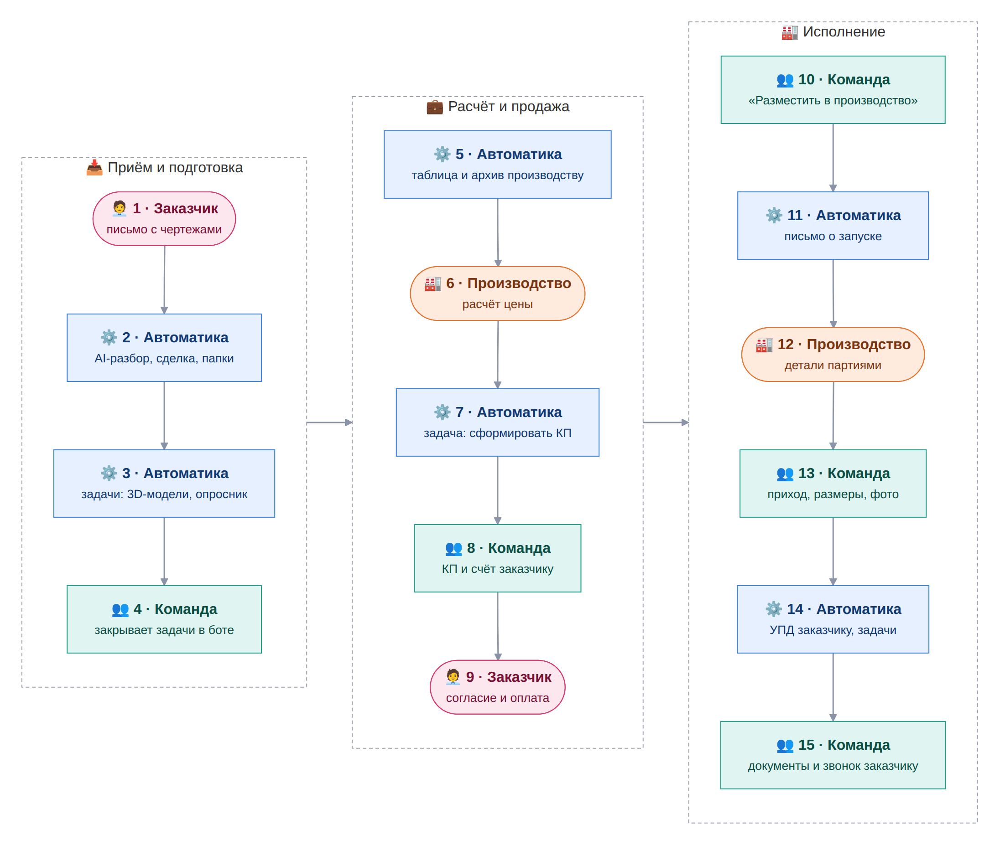

Цвет шага — участник: розовый — заказчик, синий — автоматика, бирюзовый — команда, оранжевый — производство

## Архитектура и стек

Верхний ряд — те, кто запускает процессы: ① заказчик пишет на почту, ② сотрудники получают и закрывают задачи в TG-Боте Контроль задач, ③ ассистент готовит документы в TG-Боте Бухгалтерия. Производство общается с автоматикой письмами, а у самой автоматики есть расписание: контроль сроков, напоминания, отложенные шаги. В центре n8n, внизу — модели, сервисы и хранилища.

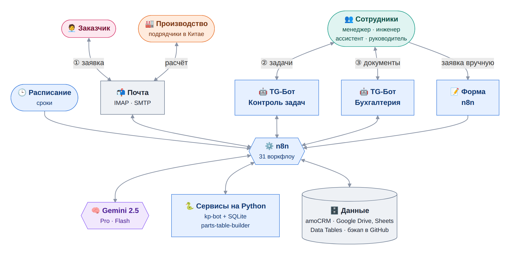

| Слой | Технологии |
|---|---|
| Оркестрация | n8n 2.x на своём VPS (Beget), Docker Compose: основной процесс и воркер; собственный образ с 7-Zip |
| CRM | amoCRM: REST API, вебхуки смены этапа, кастомные поля, задачи, примечания |
| AI | Google Gemini 2.5 Pro и 2.5 Flash с резервированием на другую модель |
| Интерфейс сотрудников | TG-Бот Контроль задач и TG-Бот Бухгалтерия |
| Сервисы на Python | [kp-bot](https://github.com/MaxBakshaev/kp-bot) (FastAPI, SQLite, Jinja2, WeasyPrint, pymorphy3), [parts-table-builder](https://github.com/MaxBakshaev/parts-table-builder) (Flask, openpyxl, poppler) |
| Файлы и формы | Google Drive, Tally (опросник по ТЗ), n8n Forms (ручной ввод заявок) |
| Почта | IMAP (чтение входящих, копии отправленных), SMTP |
| Бэкап | cron + n8n CLI + git, приватный репозиторий GitHub; снимки VPS |

Где лежат данные:

| Хранилище | Что хранит |
|---|---|
| amoCRM | сделки, контакты, компании, задачи, кастомные поля, история событий |
| Google Drive | папки компаний и заказов: чертежи, 3D-модели, `Details.txt`, расчёты, КП, УПД, фото упаковки |
| n8n Data Tables | заказы, состояние деталей, партии, черновики экранов бота, счётчики напоминаний, реестр голосовых поручений |
| SQLite (kp-bot) | диалоги бота, настройки, справочник покупателей, счётчики нумерации, замороженные снимки КП, номера платёжных документов |
| Google Sheets | ссылки на предзаполненные опросники, файлы «Расчётная цена», учёт замечаний по фотоотчётам |
| Google Apps Script | атомарные счётчики номеров заявок и компаний (`LockService`) |
| GitHub, приватный репозиторий | ночные снимки всех воркфлоу |

**Про AI.** Gemini выбран потому, что лучше других моделей разбирает чертежи при невысокой цене. Pro разбирает чертежи, расчёты производства в виде фото и таблиц и голосовые сообщения, Flash классифицирует письма, разбирает текстовые ответы и поручения и переводит описания деталей. У ключевых вызовов есть резервная модель: если основная не ответила, запрос уходит на другую. Промпты доводились итеративно: почти каждый абзац в них появился после разбора реальной ошибки. Результат модели всегда проверяет человек: AI заполняет, сотрудник подтверждает.

### 31 воркфлоу

| 🧭 Ядро · 5 | ⏰ Задачи и напоминания · 7 | 🏭 Этапы воронки · 19 |
|:---|:---|:---|
| `0` Диспетчер писем `0` Авто-рестарт диспетчера `0.1` Обработка ошибок `0.2` Роутер TG-Бота Контроль задач `0a` Форма ручной заявки | `0.3` Поиск задач для напоминаний `0.4` Напоминания по сделке `0.5` Голосовая постановка задач `0.6` Кнопки карточки задачи `0.7` Контроль голосовых задач `0.8` Правка карточки текстом `0.9` Ответы по голосовым задачам | `1` Новая заявка `2` Файловая структура `3.0`–`3.2` Сбор ТЗ и опросник `4` Проверка наименований `5` Письмо производству `6` Обработка расчёта `6` TG-Бот Бухгалтерия `9` Запрос платёжного документа `10` Запуск производства `12.0`–`12.5` Упаковка, фото, УПД `13` Отгрузка и проверка качества |

Что делает каждый из них — в [каталоге воркфлоу](docs/workflows.md).

## Этапы воронки

У каждого этапа своя мини-схема. 📌 Жёлтые флажки — задачи сотрудникам: они создаются в amoCRM и приходят в TG-Бот Контроль задач с ролью исполнителя и сроком. ➡️ Зелёные — переход на следующий этап.

### Диспетчер писем

Читает входящую почту и определяет тип письма. Формальные признаки (отправитель из производства, номер заказа в теме, файл с расчётом) код проверяет ещё до модели и при совпадении выставляет категорию сам. Отдельная эвристика отсекает подозрительные «заявки» без текста и вложений, а битая кодировка вызывает алерт вместо молчаливой ошибки. Новая заявка получает атомарный номер и создаёт сделку, расчёт от производства переводит сделку на «Обработку расчёта». Вопросы о статусе заказа, финансах, технике и логистике модель уже распознаёт, но ветки под них пока пустые: такие письма разбираются вручную.

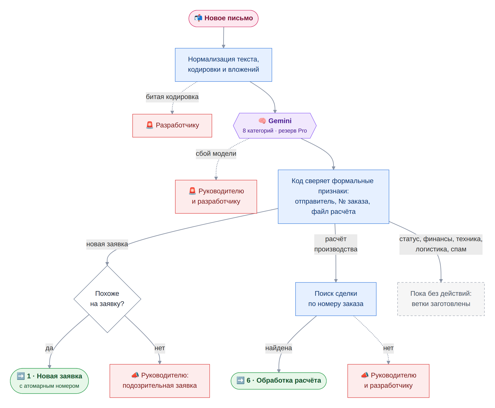

⚙️ Воркфлоу 0 «Диспетчер писем» и 0 «Авто-рестарт» · [каталог](docs/workflows.md)

### 1. Новая заявка

Вебхук amoCRM запускает разбор: письмо и вложения, распаковка zip, 7z и rar. Gemini 2.5 Pro анализирует каждый чертёж: тип (деталь или сборочный чертёж со спецификацией), материал и его группа, марка, термообработка и твёрдость, покрытия, квалитет. Результат записывается в поля сделки и в файл `parts.json`. Контакт ищется по email, компания — по названию с нечётким сравнением: порог 90 % для названий в одном алфавите и 75 % при сравнении через транслитерацию (Industries ↔ Индастриз). Если никого не нашлось, создаются новые записи. Когда данных для автоматического заполнения не хватает, руководитель получает уведомление доукомплектовать сделку вручную. Если API модели упирается в лимиты, анализ ставится на паузу и повторяется, а сбой на одном чертеже не останавливает всю заявку.

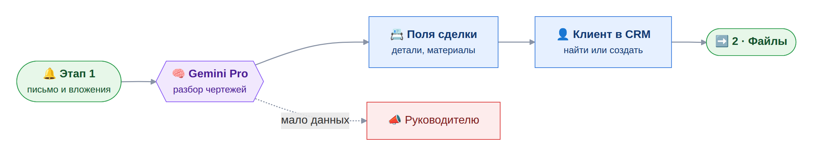

**Что автоматика заполняет в сделке:**

- номер заказа
- список деталей
- короткое название деталей
- ссылку на папку заказа
- отсутствующие 3D-модели
- файл `parts.json` с характеристиками
- статусы задач: 3D-модели, связь с клиентом, проверка файлов, КП
- ID письма с заявкой
- ID письма с расчётом
- контакт (телефон, почта, должность)
- компания (почта, сайт, адрес)

 Карточка тестовой сделки после разбора

⚙️ Воркфлоу 1 · [каталог](docs/workflows.md)

### 2. Файловая структура

Создаётся папка компании на Google Drive (с атомарным номером) и папка заказа с подпапками `1_ТЗ_и_Брифинг`, `2_Макеты_и_Дизайн`, `3_Сметы_и_Счета`. Вложения письма раскладываются в `1_ТЗ_и_Брифинг`, ссылка на папку сохраняется в сделке, и сделка переходит на «Сбор ТЗ».

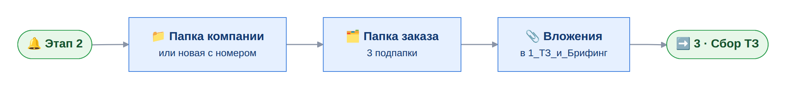

 Папка тестового заказа: номер компании, номер заказа и три подпапки

⚙️ Воркфлоу 2 · [каталог](docs/workflows.md)

### 3. Сбор ТЗ и брифинг

Сценарий зависит от того, что нашлось в чертежах. Если характеристики есть, сразу собирается `Details.txt` на русском и английском. Если нет, формируется опросник Tally, предзаполненный данными из чертежей, и менеджер получает задачу связаться с клиентом и заполнить его. Изначально опросник уходил клиенту с серией из трёх писем-напоминаний, но клиенты не любят заполнять формы сами, поэтому теперь его заполняет менеджер после разговора. Механизм писем сохранён и отключён заглушкой: этап планируется развивать. Для заявок больше чем на десять деталей опросник не формируется, руководитель получает уведомление. Если для части деталей нет 3D-моделей, инженер получает задачу их разработать. Когда опросник и 3D-модели готовы, сделка переходит на проверку наименований.

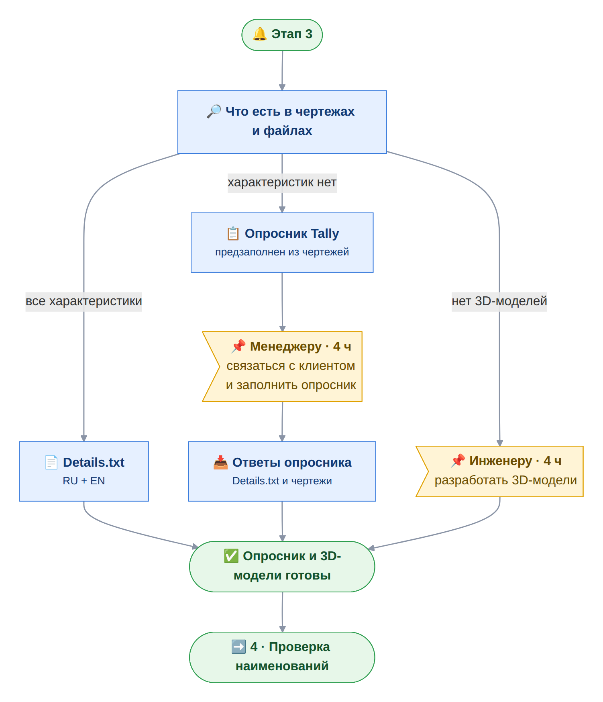

**Что спрашивает опросник по каждой детали:**

- наименование
- количество
- тип материала
- марка
- тип стали
- термообработка
- желаемая твёрдость
- химико-термическое покрытие
- электрохимическая обработка
- квалитет точности
- дополнительная информация
- чертёж (при отсутствии в заявке для данной детали)

Поля открываются уже заполненными из чертежей, менеджеру остаётся проверить и дополнить.

<table>
<tr>
<td align="center" valign="top">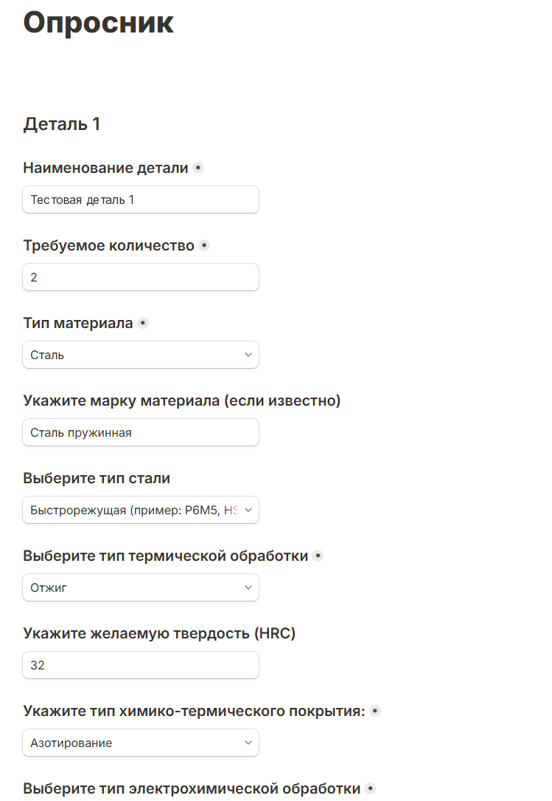</td>
<td align="center" valign="top">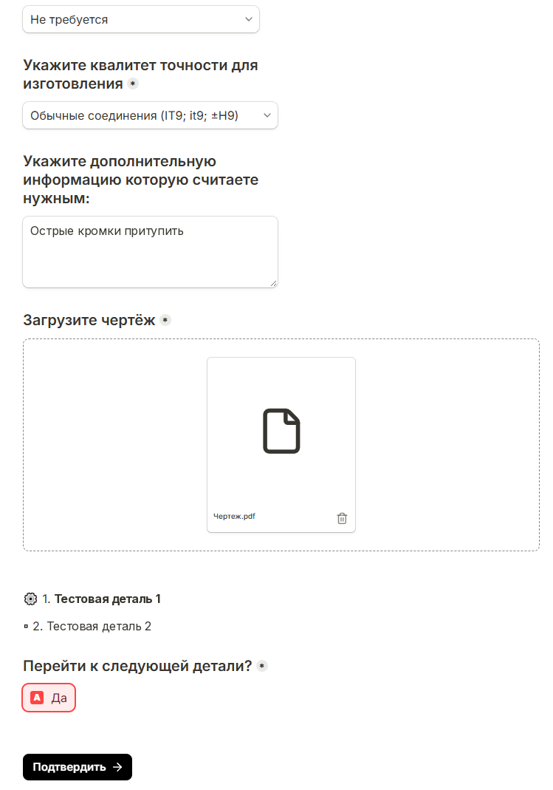</td>
</tr>
</table>

Опросник Tally, предзаполненный из чертежей

<table>
<tr>
<td align="center" valign="top"> Задача инженеру: разработать 3D-модели</td>
<td align="center" valign="top"> Задача менеджеру: связаться с клиентом и заполнить опросник</td>
</tr>
</table>

⚙️ Воркфлоу 3.0, 3.1, 3.2 · [каталог](docs/workflows.md)

### 4. Проверка наименований

Файлы папки заказа сверяются с `Details.txt`. У каждой детали должен быть комплект PDF + STP + DWG (сборочному чертежу модель не обязательна), имена приводятся к виду `1. Втулка.pdf`, дубли и мусор удаляются, а папки и файлы без расширения защищены от удаления. Если автоматика не может разобраться сама, инженер получает задачу со списком проблем. После её закрытия проверка запускается заново, и так до чистого результата.

<table>
<tr>
<td align="center" valign="middle">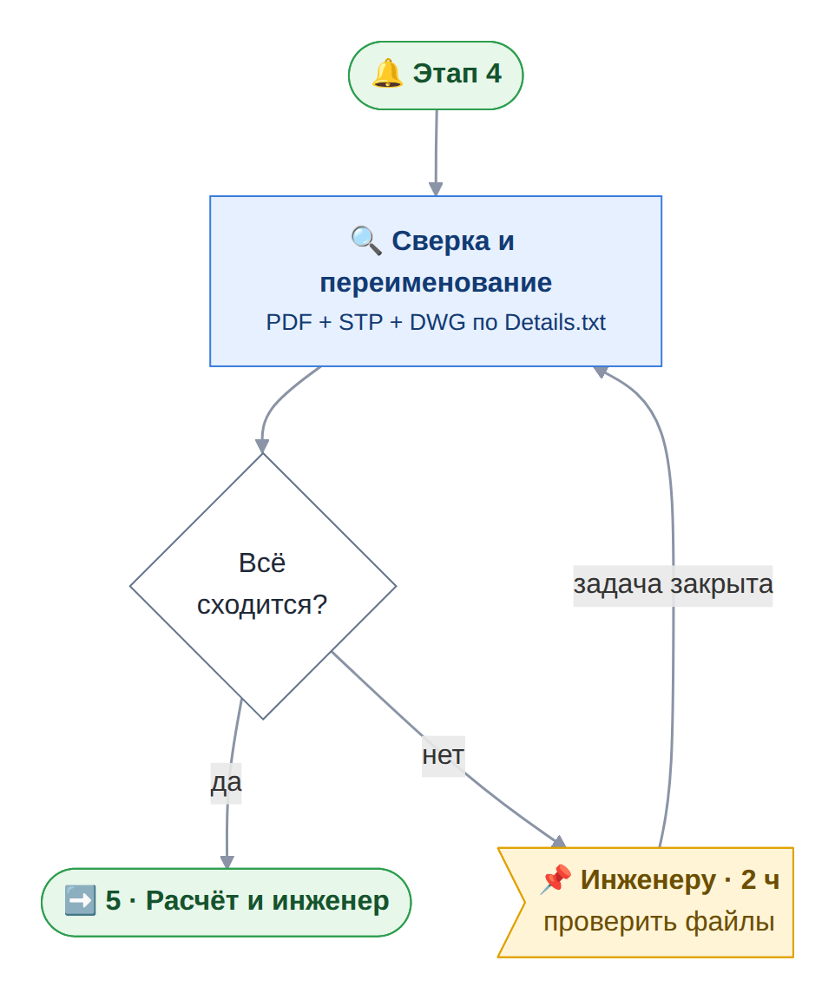</td>
<td align="center" valign="middle"> Задача инженеру: ручная проверка файлов со списком проблем</td>
</tr>
</table>

⚙️ Воркфлоу 4 · [каталог](docs/workflows.md)

### 5. Расчёт и инженер

parts-table-builder собирает из `Details.txt` и первых страниц чертежей Excel-таблицу для производства: миниатюра чертежа в ячейке, характеристики на английском, колонка цены с защитой от ввода текстом. Папка `1_ТЗ_и_Брифинг` целиком упаковывается в архив с сохранением структуры, письмо с таблицей и архивом уходит на производство, копия сохраняется в «Отправленные», а в сделку пишется примечание.

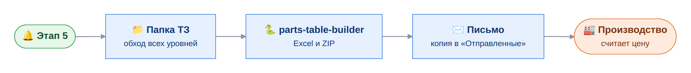

 Таблица для производства: миниатюры чертежей, характеристики, жёлтая колонка цены для подрядчика

⚙️ Воркфлоу 5 · [каталог](docs/workflows.md)

### 6. Обработка расчёта

Производство отвечает по-разному: ценой в тексте письма, фото чертежа с ценой, таблицей `.xlsx` или `.xls`. Диспетчер узнаёт такой ответ и переводит сделку на этот этап. Gemini извлекает итоговую цену и цены за единицу, а для таблиц сверяет итог с суммой позиций. Цена пишется в сделку и в файл «Расчётная цена» в папке заказа, вложения — в `3_Сметы_и_Счета`. Ассистент получает задачу сформировать КП, согласовать наценку и отправить КП клиенту; если цену распознать не удалось, приходит отдельное уведомление. Документы собираются в [TG-Боте Бухгалтерия](#tg-бот-бухгалтерия). Когда задача закрыта, сделка переходит на «КП отправлено».

<table>
<tr>
<td align="center" valign="middle">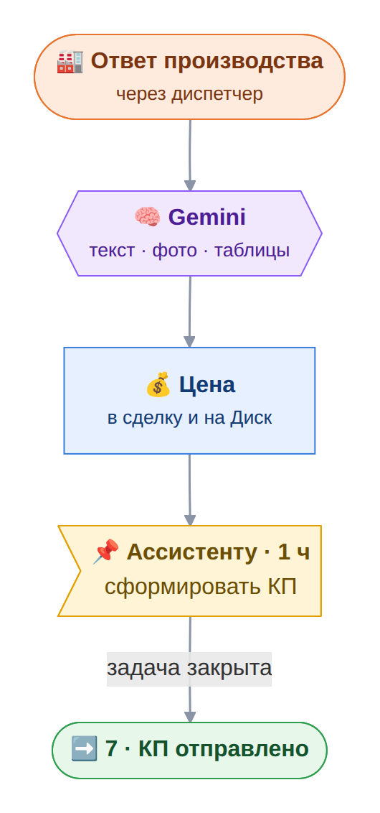</td>
<td align="center" valign="middle"> Задача ассистенту: сформировать КП, согласовать наценку и отправить клиенту</td>
</tr>
</table>

⚙️ Воркфлоу 6 «Обработка расчёта» · [каталог](docs/workflows.md)

### 7–9. КП отправлено, согласование и отработка возражений

**Работает.** На этапе «8 · Согласование / оплата» автоматика узнаёт у kp-bot вид оплаты по замороженному снимку КП. При предоплате ассистент получает задачу ввести номер и дату платёжного документа из банковской выписки: без них УПД не выпустится.

**В разработке — ИИ-агент на Claude.** Агент отправляет КП и уточняет у клиента, удалось ли с ним ознакомиться. Если клиент не отвечает, менеджер получает задачу позвонить, а итог разговора пишет в TG-Бот Контроль задач в свободной форме, и он фиксируется в сделке. Согласие переводит сделку в «Согласование / оплата», возражения — в «Отработку возражений», где агент ведёт диалог по методике продаж. Для оплаты — проверка поступления по номеру заказа раз в пять дней и звонок, если оплаты нет 15 дней. Подробности в [дорожной карте](docs/ai-agent-roadmap.md).

<table>
<tr>
<td align="center" valign="middle">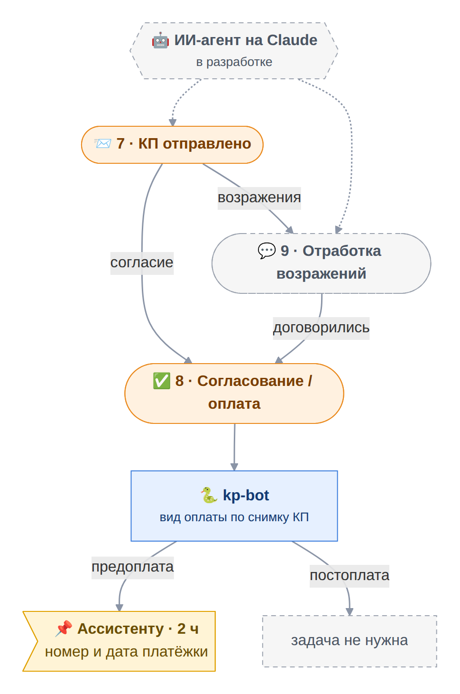</td>
<td align="center" valign="middle"> Задача ассистенту: номер и дата платёжного документа, с готовой командой для бота</td>
</tr>
</table>

⚙️ Воркфлоу 9 «Запрос платёжного документа» · [каталог](docs/workflows.md)

### 10. Производство

Руководитель или инженер нажимает в TG-Боте Контроль задач «🏭 Разместить в производство» и отправляет номер заказа. Сделка переходит на этап «Производство», папка ТЗ упаковывается в архив, производству уходит письмо о запуске. Инженер сразу получает задачу «Сделать персональную упаковку для деталей» со сроком пять суток; срок меняется кнопками прямо в карточке задачи, до 20 дней.

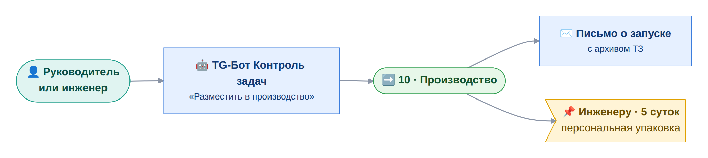

**Как это выглядит в боте:**

1. Кнопка «Разместить в производство» в меню
2. Бот присылает фразу, в которую нужно подставить номер заказа
3. Карточка задачи «Персональная упаковка» со ссылками на папку заказа и сделку
4. Кнопки смены срока: 5, 10, 15 или 20 дней
5. Итог: заказ размещён, задача поставлена, письмо отправлено

⚙️ Ветка роутера 0.2 и воркфлоу 10 · [каталог](docs/workflows.md)

### 11. В процессе доставки

Сделка ждёт здесь прихода первой партии: отметка прихода в боте сама переводит её на этап 12. Автоматическое отслеживание доставки в планах.

### 12. Упаковка и фото

Мини-приложение в TG-Боте Контроль задач поверх n8n Data Tables: у каждой детали и партии есть статус, а переходы между статусами делает автоматика. Заказы и списки деталей синхронизируются из amoCRM каждые 15 минут, повторный запуск ничего не перезаписывает.

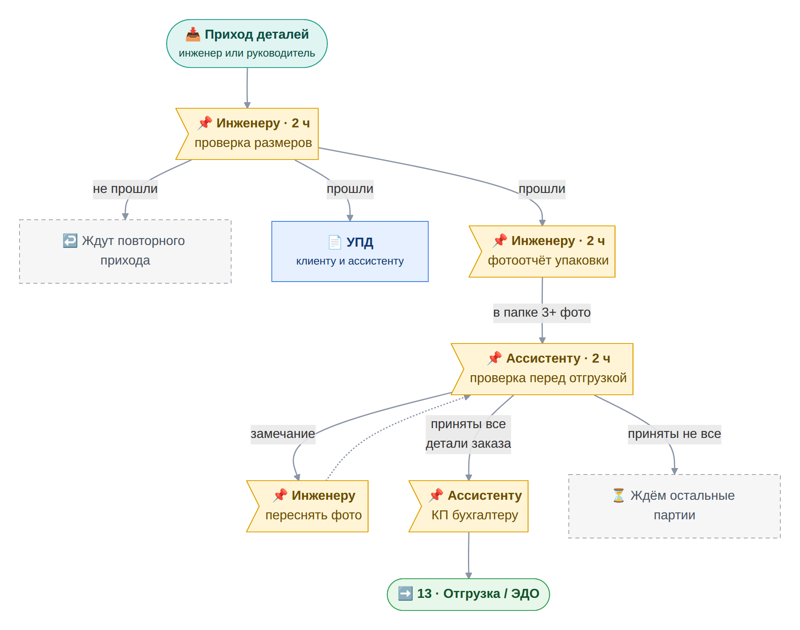

- **Приход.** Инженер или руководитель нажимает «📥 Приход деталей», вводит номер заказа и отмечает пришедшие детали с количеством — создаётся партия. Первая партия переводит сделку с «Доставки» на «Упаковку и фото».
- **Размеры и УПД.** Детали, не прошедшие проверку размеров, ждут повторного прихода. По прошедшим kp-bot выпускает УПД: подписанный уходит клиенту на почту, неподписанный — ассистенту в Telegram, оба сохраняются в папку заказа.
- **Фотоотчёт.** 3–5 фото упаковки по этапам. Бот не верит на слово: он считает файлы в папке партии на Google Drive и передаёт партию ассистенту, только если фото не меньше трёх.
- **Проверка.** Ассистент принимает фотоотчёт или возвращает его на пересъёмку с фиксацией замечания по регламенту. Раз в месяц руководитель получает сводку по замечаниям, а каждый инженер — свою часть.
- **Комплектность.** Сделка идёт дальше, только когда приняты все детали заказа: тогда ассистент получает задачу отправить КП бухгалтеру.

<table>
<tr>
<td align="center" valign="top"> Приход: инженер отмечает пришедшие детали</td>
<td align="center" valign="top"> Проверка фотоотчёта ассистентом перед отгрузкой</td>
</tr>
</table>

<table>
<tr>
<td align="center" valign="top"> Задача инженеру: проверка размеров партии</td>
<td align="center" valign="top"> Задача инженеру: фотоотчёт упаковки</td>
</tr>
</table>

⚙️ Воркфлоу 12.0–12.5 и 12.2 «УПД» · [каталог](docs/workflows.md)

### 13. Отгрузка / ЭДО

Когда приняты все детали, ассистент отправляет бухгалтеру КП для отгрузочных документов. Через 12 часов после закрытия этой задачи он получает следующую: уточнить у бухгалтера, отправлены ли документы клиенту. Её закрытие переводит сделку на проверку качества. Отложенные шаги считает расписание: воркфлоу запускается каждые 20 минут и перед любым переводом проверяет текущий этап, чтобы не вернуть сделку назад.

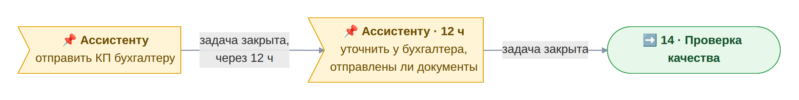

<table>
<tr>
<td align="center" valign="top"> Задача ассистенту: отправить КП бухгалтеру</td>
<td align="center" valign="top"> Задача ассистенту: уточнить у бухгалтера отправку документов</td>
</tr>
</table>

### 14. Проверка качества у клиента

Через семь дней после отправки документов менеджер получает задачу связаться с клиентом и узнать, всё ли в порядке с деталями. Срок — сутки, а если задача зависнет, её подхватят напоминания, как и любую другую. Закрытие задачи переводит сделку в «Успешно реализовано».

<table>
<tr>
<td align="center" valign="middle">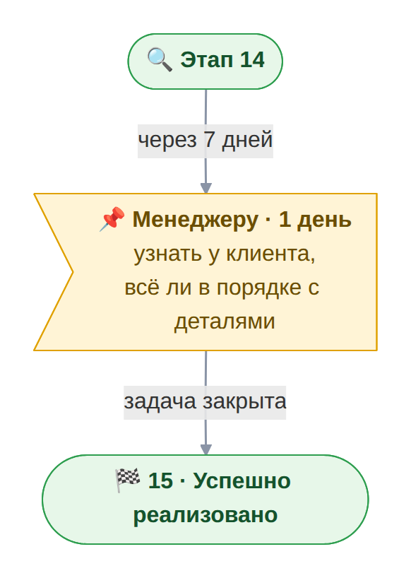</td>
<td align="center" valign="middle"> Задача менеджеру: узнать у клиента, всё ли в порядке с деталями</td>
</tr>
</table>

⚙️ Этапы 13 и 14 ведёт воркфлоу 13 · [каталог](docs/workflows.md)

### 15. Успешно реализовано

Сделка закрывается с полной историей: каждое значимое действие автоматики и сотрудников (смена этапа, отправленное письмо, полученная цена, закрытая задача, перенос срока) пишется примечанием в карточку. Ниже лента тестовой сделки от заявки до отправки КП: этапы сменяются сами, а задачи закрываются ответами в боте.

### 0. Отладка

Служебный этап-карантин. Сюда автоматика переводит сделку при сбое или нештатной ситуации, например если тема задачи не распознана, чтобы ничего не потерялось, пока разработчик разбирается.

## Сквозные подсистемы

### TG-Бот Контроль задач

Главный рабочий инструмент сотрудников: задачи из amoCRM приходят карточками в Telegram, и работать с ними можно прямо в чате.

| Роль | Меню бота |
|---|---|
| Руководитель | Мои заказы · Мои партии · Приход деталей · Мои проверки · Разместить в производство |
| Инженер | Мои заказы · Мои партии · Приход деталей · Разместить в производство |
| Ассистент | Мои проверки |

**Поручения голосом и текстом.** Руководитель диктует или пишет поручение. Gemini выделяет одну или несколько задач, исполнителя, срок и связанную сделку: её он ищет по упомянутому контакту или компании, в том числе через транслит и нечёткое сравнение. Бот показывает карточку, где кнопками можно сменить сделку, исполнителя и срок или поправить задачу свободным текстом. Ставить задачи может только пользователь из белого списка.

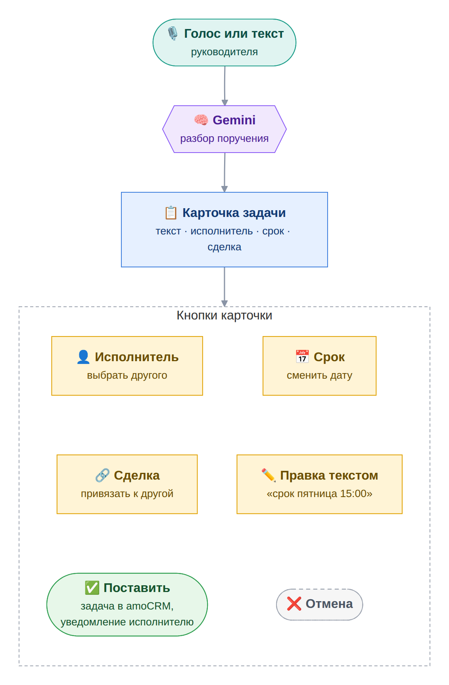

**Ответы на задачи.** Исполнитель отвечает на сообщение задачи обычным текстом, например «готово» или «перенесите на пятницу». Gemini определяет намерение, и задача закрывается или получает новый срок. По голосовым поручениям ответ со статусом дописывается в задачу, а перенос срока применяется только после подтверждения руководителя. Задачи, которые закрываются кнопками бота, ответом закрыть нельзя — только перенести срок.

 Ответ исполнителя «готово» закрывает задачу в amoCRM

**Напоминания и контроль.** Каждый час бот обходит сделки с открытыми задачами. Напоминания нарастают по цвету, а начиная с четвёртого руководитель получает эскалацию на каждом напоминании, пока задача не закрыта. Для голосовых поручений отдельно работают вопрос о статусе, сигнал руководителю, если исполнитель молчит, предупреждение перед дедлайном и фиксация просрочки.

<table>
<tr>
<td align="center" valign="top"> Карточка задачи из голосового сообщения  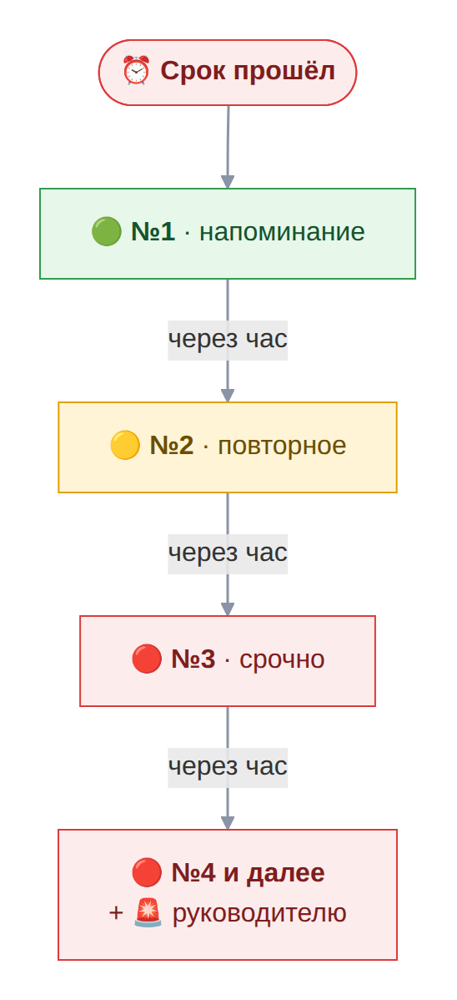</td>
<td align="center" valign="top"> Напоминания четырёх уровней и эскалация руководителю</td>
</tr>
</table>

### TG-Бот Бухгалтерия

Отдельный Telegram-бот с бэкендом kp-bot на FastAPI ([репозиторий](https://github.com/MaxBakshaev/kp-bot)). Ассистент присылает позиции с себестоимостью, бот считает цену (себестоимость × курс × наценка × (1 + НДС)) с округлением, присылает PDF на проверку и пересобирает его по правкам наценки прямо в чате. После утверждения выпускаются КП и счёт, а для покупателей с договором — спецификация и приложение с чертежами, которые n8n находит в папке заказа. УПД собирается на этапе 12 в двух версиях, подписанной для клиента и без подписи для бухгалтерии, со сквозной нумерацией кодов товара и счетов-фактур; номера сдвигаются только после успешного выпуска, поэтому в нумерации не бывает пропусков. УПД привязан к замороженному снимку КП, поэтому цены не «уезжают», даже если настройки изменились после отгрузки. Состояние бота хранится в SQLite.

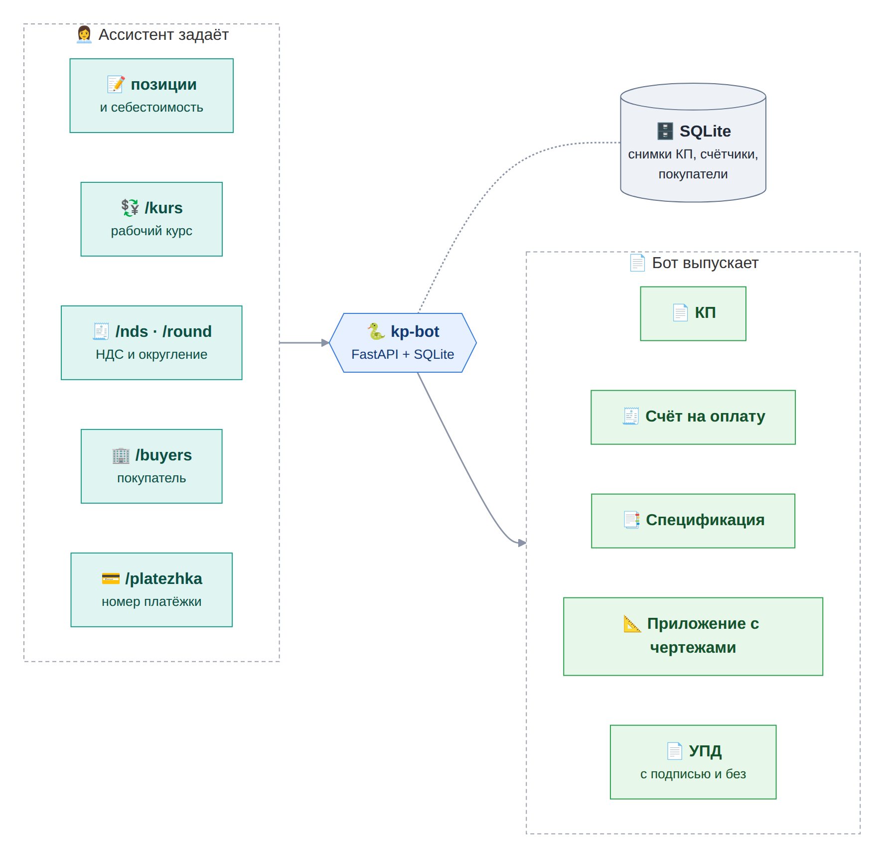

| Команда | Назначение | Команда | Назначение |
|---|---|---|---|
| `/new` | начать новое КП | `/settings` | текущие настройки |
| `/doc` | прислать документ заново | `/calc` | внутренняя калькуляция |
| `/number` | сменить нумерацию | `/code` | код товара |
| `/buyers` | справочник покупателей | `/upd` | номер счёта-фактуры |
| `/spec` | номер спецификации | `/platezhka` | платёжно-расчётный документ |
| `/kurs` | рабочий курс валюты | `/round` | округление цены |
| `/nds` | ставка НДС | `/help` | справка |

<table>
<tr>
<td valign="top">
<b>Диалог с ботом</b>
<ol>
<li>Позиции одной строкой: наименование, количество, себестоимость</li>
<li>Бот показывает покупателя, рабочий курс и НДС и спрашивает наценку</li>
<li>PDF на проверку: цена по каждой позиции, итог, НДС, валовая прибыль</li>
<li>Кнопки: утвердить, добавить или убрать позицию, условия оплаты, сменить покупателя</li>
</ol>
</td>
<td align="center" valign="top"></td>
</tr>
</table>

Документы, которые собирает бот:

| КП | Счёт на оплату |
|---|---|
|  |  |

| Спецификация к договору | Приложение с чертежом |
|---|---|
|  |  |

| УПД — таблица позиций | УПД — подписи и печать |
|---|---|
|  |  |

### Заявки через форму n8n

Чтобы завести заявку вручную (например, если чертежи пришли не на почту), есть внутренняя форма из трёх шагов. Форма отправляет обычное письмо на ящик заявок со служебными маркерами ID, поэтому заявка проходит тот же конвейер, но клиент берётся по ID, без нечёткого поиска.

<table>
<tr>
<td align="center" valign="middle">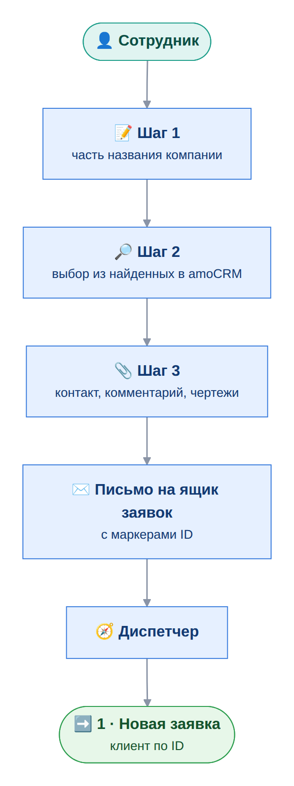</td>
<td align="center" valign="top"></td>
</tr>
</table>

## Надёжность, безопасность и бэкап

**Обработка ошибок.** Общий обработчик ошибок присылает два сообщения: разработчику — технические детали и что проверить, руководителю — понятное описание, что сделать вручную. Нода-виновник определяется автоматически, и под неё подбирается пояснение. Вокруг обращений к amoCRM, Google, Data Tables и Gemini стоят локальные ветки ошибок с такими же двойными уведомлениями. Диспетчер писем каждое утро в 04:00 перезапускается с проверкой статуса: без перезагрузки IMAP-триггер примерно через месяц тихо переставал получать письма.

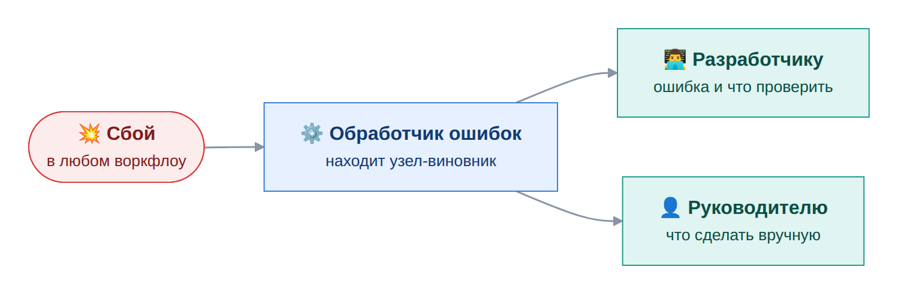

| Кому | Сообщение |
|---|---|
| 👨‍💻 Разработчику: узел, ошибка и что проверить |  |
| 👤 Руководителю: что случилось и что делать |  |

**Безопасность.** Токены и пароли хранятся только в credentials n8n и переменных окружения и не попадают в данные выполнений. Telegram ID и имена сотрудников тоже вынесены в переменные окружения. Вебхуки amoCRM защищены секретом: без него выполнение обрывается. Ставить задачи через бота может только пользователь из белого списка, а набор действий в меню зависит от роли.

**Бэкап.** Каждую ночь cron выгружает все воркфлоу в приватный репозиторий GitHub. Файлы получают читаемые имена, черновики с префиксом `[test]` пропускаются, `pinData` и поле `shared` с email владельца вычищаются, перед коммитом работает проверка gitleaks. Коммит появляется, только если что-то изменилось, и перечисляет изменённые воркфлоу. Доступ идёт через SSH deploy key, привязанный к одному репозиторию. Сам сервер дополнительно защищён снимками VPS.

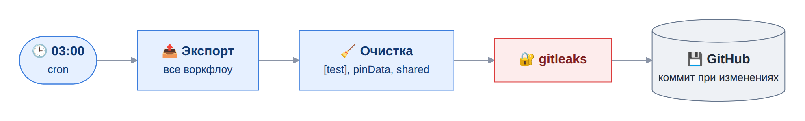

## Статус и планы

| Блок | Статус |
|---|---|
| Приём заявок, файлы, ТЗ, проверка наименований (этапы 1–4) | ✅ в эксплуатации |
| Расчёт производства, КП, счёт, спецификация (этапы 5–6) | ✅ в эксплуатации |
| Запрос платёжного документа (этап 8) | ✅ в эксплуатации |
| Производство, упаковка, фото, УПД (этапы 10 и 12) | ✅ в эксплуатации |
| Отгрузка, ЭДО, проверка качества (этапы 13–15) | ✅ в эксплуатации |
| TG-Бот Контроль задач: голосовые поручения, ответы, напоминания | ✅ в эксплуатации |
| Ночной бэкап воркфлоу | ✅ в эксплуатации |
| ИИ-агент на Claude: реактивация клиентов и этапы 7–9 | 🚧 в разработке |
| Контроль оплаты | 🚧 в разработке |
| Доработка этапа «Сбор ТЗ» | 📝 планируется |
| Отслеживание доставки (этап 11) | 📝 планируется |

Ближайшая большая задача — ИИ-агент для переписки с клиентами. Архитектура агентного цикла, правила диалога и порядок внедрения описаны в [дорожной карте](docs/ai-agent-roadmap.md).
