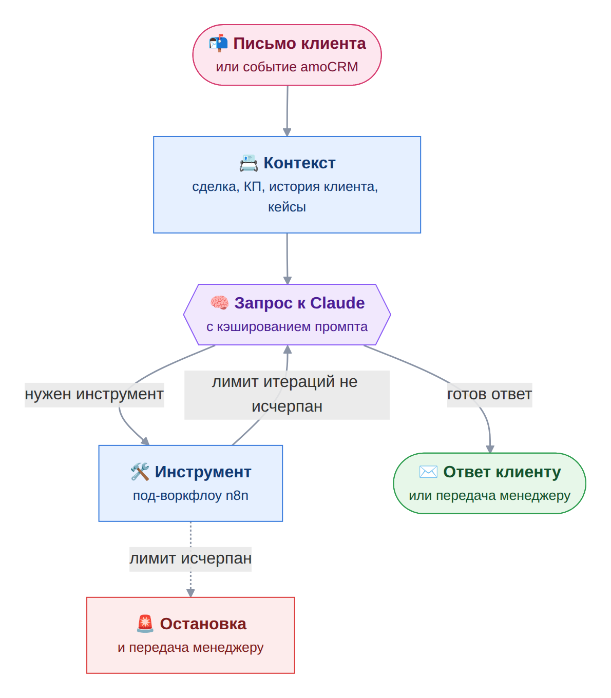

# ИИ-агент для переписки с клиентами: дорожная карта

> Статус: в разработке. Здесь план, который будет уточняться по ходу внедрения. Общая картина проекта — в [README](../README.md).

## Зачем

Работа с базой существующих клиентов и этапы 7–9 воронки — это переписка: отправить КП, дождаться ответа, напомнить о себе, ответить на сомнения, договориться о следующем шаге. Сейчас её ведёт менеджер вручную. Цель — чтобы рутинную часть переписки вёл агент, а менеджер подключался там, где нужен человек: цена и условия, звонок, нестандартная ситуация.

Модель — Claude, конкретная версия будет выбрана по итогам тестов на реальных диалогах.

## Этапы внедрения

### Этап 1. Реактивация клиентской базы

Агент возобновляет контакт с клиентами, которые уже работали с компанией: напоминает о себе конкретным поводом из истории клиента, выясняет текущую ситуацию и при появлении интереса передаёт диалог менеджеру. Входные данные — история по каждому клиенту и база кейсов.

### Этап 2. Встраивание в воронку, этапы 7–9

| Этап воронки | Что делает автоматика | Где подключается человек |
|---|---|---|
| 7 · КП отправлено | Агент отправляет КП и уточняет, удалось ли ознакомиться. Согласие переводит сделку в «Согласование / оплата», возражения — в «Отработку возражений». | Нет ответа — задача менеджеру позвонить. Итог звонка менеджер пишет в TG-Бот Контроль задач в свободной форме, он фиксируется в сделке. |
| 8 · Согласование / оплата | Раз в пять дней — задача проверить поступление оплаты по номеру заказа. Запрос платёжного документа для УПД уже работает. | Через 15 дней без оплаты — задача позвонить и выяснить причину, итог в свободной форме. |
| 9 · Отработка возражений | Агент ведёт диалог по методике продаж, опираясь на историю клиента и базу кейсов. Если договорились, сделка переходит в «Согласование / оплата». | Окончательный отказ: сессия по заказу закрывается, сохранённый контекст диалога очищается. |

## Архитектура

За основу берётся подход из [ai-parent-interview-bot](https://github.com/MaxBakshaev/ai-parent-interview-bot) — бота на n8n и Claude, который проводит структурированные интервью.

- **Ручной агентный цикл вместо встроенного узла AI Agent.** Запрос к Anthropic Messages API, разбор ответа, выполнение запрошенного инструмента отдельным под-воркфлоу, возврат результата модели — и так, пока не получится текстовый ответ. Лимит итераций с аварийной остановкой защищает от зацикливания, а каждый шаг виден в истории выполнений n8n.
- **Кэширование промпта.** Статичный системный промпт, описания инструментов и накопленная история помечаются `cache_control`. В ai-parent-interview-bot это снизило стоимость одного полного диалога примерно на порядок, с $1–2 до $0,1–0,2.
- **Память.** История диалога хранится по клиенту и подгружается на каждом шаге, а при закрытии сессии очищается.
- **Служебные данные подставляет n8n.** ID сделки, чата и заказа модель не видит и не передаёт: их добавляет воркфлоу при вызове инструмента.
- **Санитизация ответа.** Если модель выдала вызов инструмента сырым текстом, он вырезается до отправки клиенту.
- **Отложенные действия.** Повторное касание через заданное время работает как отдельный под-воркфлоу напоминания.

Предварительный набор инструментов:

| Инструмент | Что делает |
|---|---|
| Контекст сделки | этап, КП, история переписки, заметки менеджера |
| Поиск кейса | подходящий кейс из базы по отрасли и типу задачи |
| Письмо клиенту | ответ в той же ветке переписки |
| Запись в сделку | примечание с итогом шага |
| Задача менеджеру | позвонить, ответить на вопрос о цене или условиях |
| Смена этапа | перевод сделки по итогу диалога |
| Напоминание | повторное касание через заданное время |
| Передача менеджеру | эскалация с кратким изложением диалога |

## Каркас диалога

Диалог строится на трёх слоях, а не на одном большом промпте:

1. **Каркас** — стадии диалога и правила перехода между ними, задаются жёстко.
2. **Факты** — история клиента и база кейсов. Агент берёт из них данные, но ничего не придумывает.
3. **Формулировки** — свобода агента в естественном языке внутри первых двух слоёв.

| Стадия | Цель | Когда дальше | Чего агент не делает |
|---|---|---|---|
| A. Открытие | напомнить о себе конкретным поводом из истории клиента | любой содержательный ответ | не предлагает решений, не называет цифр |
| B. Выявление ситуации | понять, что изменилось и есть ли потребность: сначала открытые вопросы о ситуации, затем о задачах, затем о том, что мешает их закрыть | названа потребность; если «неактуально» — мягкое закрытие с пометкой вернуться через N месяцев | не переходит к продаже |
| C. Релевантный опыт | показать один-два кейса, совпадающих по отрасли или типу задачи | клиент реагирует на кейс | не придумывает кейсы: нет подходящего — говорит об опыте в общих чертах или передаёт менеджеру |
| D. Возражения | ответить на типовые возражения (бюджет, сроки, «уже работаем с другим подрядчиком», нет ресурса) по заранее описанной логике | возражение снято или диалог передан | не спорит и не давит |
| E. Следующий шаг | при конкретном интересе (детали, цена, звонок, сроки) зафиксировать контекст и передать диалог менеджеру | — | не продаёт и не обсуждает условия |

Методика продаж используется как принцип построения вопросов в стадиях B и D, а не как текст для цитирования.

### Жёсткие правила

- Агент никогда не придумывает цифры (сроки, стоимость, метрики), факты о прошлых проектах и обещания от имени компании.
- Обязательная передача менеджеру: вопрос о цене или условиях, просьба о звонке или встрече, любой сигнал недовольства, юридические и договорные вопросы, неуверенность в фактах.
- Других клиентов агент упоминает только с явным разрешением в базе кейсов (по умолчанию действует NDA), конкурентов не обсуждает, заявлений от имени руководства не делает.
- При любой неопределённости — уточняющий вопрос или передача человеку, но не догадка.

### Формат базы кейсов

| Поле | Содержание |
|---|---|
| Отрасль клиента | для подбора по совпадению |
| Тип задачи | какая проблема решалась |
| Что сделано | кратко, без внутренних деталей |
| Результат | только если его можно называть; нет точной цифры — не указывается |
| Разрешение называть клиента | да или нет, есть ли цитата |
| Теги | отрасль, тип задачи, размер компании |

## Порядок внедрения

1. Оформить 3–5 кейсов в формате базы.
2. Прогнать полный цикл A–E вручную на 2–3 реальных клиентах: написать письма «как бы от агента» по стадиям и правилам.
3. Разобрать, где логика стадий и правила ломаются на практике, и поправить каркас.
4. Собрать агентный цикл в n8n, подключить инструменты и кэширование.
5. Режим черновиков: агент готовит письмо, менеджер одной кнопкой подтверждает отправку.
6. Самостоятельная работа агента внутри каркаса с передачей менеджеру по правилам.
7. Встраивание в этапы 7–9 воронки.
